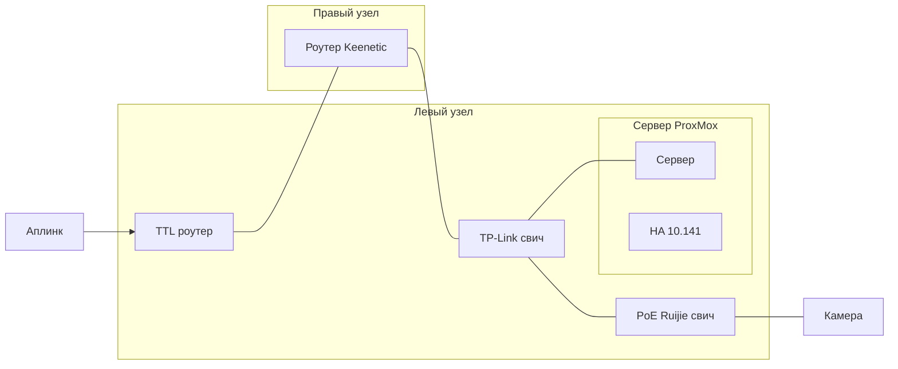

# SMART-HOME-SPEC.md

## 🧱 1. Аппаратная конфигурация
| Компонент | Описание |
|------------|-----------|
| CPU | Intel i7 12-го поколения (без iGPU) |
| GPU | NVIDIA RTX 3060 Ti (8 GB VRAM) |
| RAM | 32 GB |
| SSD | 510 GB (система Debian 13 + XFCE + Docker + KVM + виртуалки) |
| HDD | 2 TB (ext4, смонтирован в `/srv/home-automation`) — данные умного дома |
| ОС | Debian 13 (XFCE) |
| BIOS/Boot | UEFI, GPT разметка |

## 🌐 2. Сетевая конфигурация
- Основная сеть: `192.168.10.0/24`
- Сервер Debian: `192.168.10.140` (статический IP)
- Виртуальная машина HAOS: `192.168.10.53`
- Бридж KVM: `br0` (связан с основным интерфейсом)
- Доступ:  
  - Home Assistant → `http://192.168.10.53:8123`  
  - Wyoming Whisper GPU → `tcp://192.168.10.140:10300`

## 🐳 3. Docker-инфраструктура
**Расположение compose-файлов (SSD)**  
`/opt/home-automation/`

**Данные (HDD)**  
`/srv/home-automation/`

### Активные контейнеры

| Сервис | Образ | Назначение | Сеть | GPU | Путь данных |
|---------|--------|-------------|------|-----|-------------|
| **Samba** | `dperson/samba` | Общий доступ по SMB к файлам умного дома | host | – | `/srv/home-automation/samba/share` |
| **Wyoming Whisper GPU** | `ghcr.io/slackr31337/wyoming-whisper-gpu:latest` | STT-сервис на базе faster-whisper для Home Assistant | host:10300 | ✅ | `/srv/home-automation/wyoming-whisper` |

## 🧩 4. Home Assistant OS (в KVM)
- VM название: `haos-25`  
- Тип: KVM/QEMU (мост `br0`)  
- IP: `192.168.10.53`
- Интеграции:  
  - **Wyoming** (подключение к STT на 192.168.10.140:10300)  
  - **MQTT** (встроенный аддон Mosquitto)  
  - **Samba addon — не используется** (заменён докер-контейнером на Debian)  
- Приложение HA Companion используется для голосового ввода (Assist pipeline).

## 🧠 5. Архитектура и взаимодействие
```text
[ESP32 Mic Nodes]  → (MQTT/WiFi)
                              \
                               →  [HAOS VM @192.168.10.53]
                                     | Assist Pipeline
                                     ↓
                               [Wyoming Whisper GPU @192.168.10.140:10300]
                                     |
                                     → faster-whisper → CUDA (3060 Ti)
                              
[Frigate] (планируется) → GPU аналитика видео → MQTT → HAOS
[Samba] → общие папки / архивы видео → сеть
```

## ⚙️ 6. Автозагрузка
- Docker демон: `systemctl enable docker`
- Контейнеры с `restart: unless-stopped` → автоматически поднимаются после ребута.
- VM HAOS автостартует через libvirt/KVM.

## 📂 7. Директории проекта
```text
/opt/home-automation/
 ├── samba/
 │    └── docker-compose.yml
 ├── wyoming-whisper/
 │    └── docker-compose.yml
 └── frigate/        (резерв под будущее)

/srv/home-automation/
 ├── samba/share/
 ├── wyoming-whisper/
 └── frigate/{config,media,db}/
```

## 8. Топология сети



## 🚀 8. TODO / Planned
| Задача | Статус |
|--------|---------|
| GPU-Frigate в Docker + интеграция в HA через MQTT | 🕓 план |
| HTTPS для HAOS (через NGINX Proxy или Let’s Encrypt) | 🕓 план |
| Резерв копии данных (HDD → Samba/NAS/Cloud) | 🕓 план |
| Мониторинг GPU/системы (Prometheus + Grafana) | 🕓 план |
| DHCP vs Static IP ревизия для прод-сети | ✅ настроено (192.168.10.140) |

## 📑 9. Контрольная проверка
| Компонент | Проверка | Результат |
|------------|-----------|-----------|
| GPU-CUDA в Docker | `docker exec -it wyoming-whisper nvidia-smi` | ✅ видит 3060 Ti |
| Порт STT | `ss -tulnp | grep 10300` | ✅ LISTEN |
| HAOS ↔ Wyoming | тест Assist через приложение | ✅ отлично распознаёт |
| Samba шары | `smbclient -L localhost -U admin` | ✅ видны |
