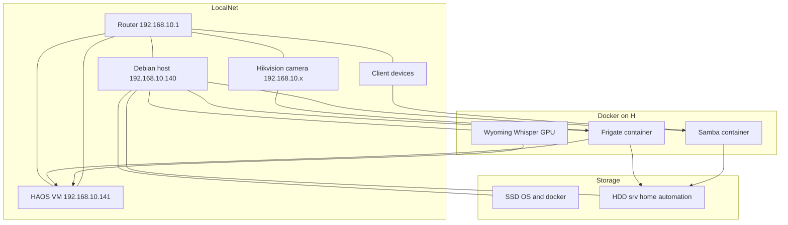

## SN1H IoT Infrastructure. Сухроб умный дом.

### Оглавление

1. Раздел A — Резюме и ключевые решения
2. Раздел B — Сетевая схема
3. Раздел C — Диаграмма инфраструктуры
4. Раздел D — Технические детали и архитектурные пояснения
5. Раздел E — Логика контейнеров
6. Раздел F — План работ (TODO)

---

## Раздел A — Резюме и ключевые решения

## Контекст текущего чата (резюме ≤15 000 символов)

### 1) Общая цель

Развёртывание домашней инфраструктуры: HAOS в KVM, Docker‑сервисы на SSD/HDD, GPU‑SST (Wyoming Whisper), Frigate (GPU, интеграция с HAOS), Samba‑шары и устойчивая архитектура хранения.
HAOS крутится в KVM (QEMU) под управлением libvirt.

### 2) Дисковая архитектура

* SSD — система и контейнеры Docker (независимость от HDD).
* HDD `/dev/sda2` → ext4, метка `home-automation`, монтирование в `/srv/home-automation` через UUID в `/etc/fstab`.
* Каталоги на HDD: `frigate/{config,media,db}`, `samba/share`, `wyoming-whisper` (данные), при этом docker‑compose и конфиги размещаются на SSD в `/opt/home-automation/...`.

### 3) Сетевые изменения

* Локальная сеть дома: 192.168.110.0/24 → прод‑подсеть 192.168.10.0/24.
* Сервер Debian получил IP 192.168.10.140; HAOS (KVM, bridge `br0`) — 192.168.10.141.
* Поиск IP HAOS через `nmap` / MAC QEMU, проверка порта 8123 — доступ подтверждён.

### 4) Samba

* Контейнер из `/opt/home-automation/samba/docker-compose.yml`.
* Экспорт шар `Share`, проверка через `smbclient -L localhost -U admin`.
* Принята стратегия: конфиги/compose — на SSD; данные шары — на HDD.

### 5) Wyoming Whisper

* Первый образ без флага `--listen` (ошибка аргумента) — заменён корректным вариантом.
* CPU‑версия: сервис поднялся на `0.0.0.0:10300`.
* Далее установлен GPU‑образ `ghcr.io/slackr31337/wyoming-whisper-gpu:latest`; порт 10300 слушается, внутри контейнера `nvidia-smi` показывает RTX 3060 Ti.
* Директория данных на HDD (`/srv/home-automation/wyoming-whisper`), контейнер и compose — на SSD.

### 6) HAOS и интеграции

* HAOS доступен по 192.168.10.141.
* Добавление HACS → интеграция Frigate стала доступной и подключена (логин/пароль Frigate зафиксированы пользователем).

### 7) Frigate (GPU + интеграция с HAOS)

**Статус:** контейнер в состоянии `healthy`, БД мигрирована, MQTT‑доступ проверен (топик `frigate`, клиент `frigate`). При первом запуске создан пользователь `admin` с авто‑паролем (в логах). Перезапуск выполнять через полный цикл:

```
cd /opt/home-automation/frigate
docker compose down
docker compose up -d
```

#### Конфигурация и потоки

* Камера `hikvision_front`, два RTSP‑потока: `102` — детекция (низкий битрейт), `101` — запись (основной).
* FFmpeg: `hwaccel_args: preset-nvidia-h264`.
* Детектор (временно):

```yaml
detectors:
  cpu1:
    type: cpu
```

(планируется перенос на GPU‑backend: TensorRT / ONNX / OpenVINO).

* Детект‑поток закреплён на `1280x720 @ 5fps`.

#### Детекция / объекты / зоны

* Трекинг объектов: `person`, `cat` (ошибка из‑за отсутствия `cat` в `objects.track` устранена).
* Зоны (созданы и проверены в UI):

  * `zone1_hall` — коридор (основная зона наблюдения)
  * `zone2_door` — у двери (зона повышенного внимания)
* Настройки зон в конфиге синхронизированы с UI. В MQTT‑событиях `frigate/events` подтверждены поля:

  * `current_zones`, `entered_zones` — заполняются корректно при входе объекта в полигон.
* `review.alerts.required_zones: zone2_door` — события на ревью только при пересечении зоны у двери.

#### Движение / запись / снепшоты

* Детекция движения используется как предфильтр (порог=30, площадь=10, контрастность — включена).
* Запись: `record.enabled: true`, `mode: motion`, удержание 3 дня.
* Снепшоты включены, удержание по умолчанию 3 дня.

#### Интеграция с Home Assistant

* Сенсоры доступны: `Motion`, `Person`, `Recordings`, `Review Status`, счётчики объектов и активности.
* События поступают в HA через `frigate_event` и/или MQTT‑триггеры. Проверено внешним клиентом (MQTT.fx): события содержат `label`, `score`, `box`, `current_estimated_speed`, зоны.

#### Практические заметки

* Предпочтительный перезапуск — `down && up -d` (простое `restart` иногда приводит к бутлупу).
* Рекомендуемая схема: детект — на низкоресурсном потоке, запись — на основном; правки зон — через UI с последующей проверкой в MQTT‑событиях.

#### Следующие шаги

1. Перенос детектора на GPU‑backend и проверка производительности.
2. Добавить автоматизацию HA для уведомлений по событиям в `zone2_door` (MQTT или `frigate_event`).
3. Зафиксировать шаблоны уведомлений и правила ретенции (видео/снепшоты) для продакшен‑профиля.


### 8) Принципы надёжности

* Контейнеры на SSD должны стартовать независимо от наличия HDD.
* Данные (медиа, записи, большие объёмы) — на HDD; конфиги/compose — на SSD.

### 9) Выполненные проверки

* Порты сервисов: Whisper — 10300 (LISTEN), Frigate — UI сработал, интеграция в HAOS активна.
* GPU‑доступ в контейнере подтверждён.

### 10) Следующие шаги (план)

* Перевести Frigate на поддерживаемый GPU‑детектор (например, TensorRT/ONNX по документации версии).
* Добавить автомонтирование/пермишены для каталогов записей и снапшотов на HDD.
* Настроить резервное копирование конфигов `/opt/home-automation/*` и данных на HDD.

---

---

## Раздел B — Сетевая схема

### 1. Сетевая схема

#### Узлы

* Узел 1: роутер — сеть 192.168.10.0/24, шлюз по умолчанию.
* Узел 2: сервер Debian

  * IP: 192.168.10.140
  * Роль: хост для KVM и Docker, GPU.
* Узел 3: VM HAOS

  * IP: 192.168.10.141
  * Интерфейс: `vnet0` через мост `br0` хоста.
* Узел 4: камера Hikvision

  * IP: 192.168.10.x
  * Протокол: RTSP.

#### Порты и протоколы

* Home Assistant: `8123/tcp` на 192.168.10.141.
* MQTT брокер Mosquitto внутри HAOS: `1883/tcp`.
* Frigate UI и API: `5000/tcp` на 192.168.10.140.
* Frigate restream RTSP: `8554/tcp` и WebRTC `8555/tcp, 8555/udp` на 192.168.10.140.
* Wyoming Whisper: `10300/tcp` на 192.168.10.140.
* Samba: порт SMB от контейнера до хоста и далее в локальную сеть.

#### Логические потоки

* Видео: Hikvision RTSP → Frigate (host network) → записи на HDD → события в MQTT.
* События: Frigate → MQTT брокер HAOS → Home Assistant сущности и автоматизации.
* Аудио: микрофоны ESP32 и USB → HAOS → интеграция Wyoming → контейнер Whisper → текст обратно в HA.
* Файлы: клиенты сети → Samba контейнер → `/srv/home-automation` на HDD.

---

---

## Раздел C — Диаграмма инфраструктуры

### 1. Диаграмма инфраструктуры



---

---

## Раздел D — Технические детали и архитектурные пояснения

### 1. Технические детали и разгрузка решений

#### Wyoming Whisper (GPU) — архитектура и интеграция

* Контейнер: ghcr.io/slackr31337/wyoming-whisper-gpu
* Модель скачана локально в /srv/home-automation/wyoming-whisper (~1.5–3.8 GB)
* Запуск через порт 10300, backend = CUDA, compute offloaded на RTX 3060 Ti
* Причина выбора Wyoming: нативная интеграция с Home Assistant Voice + стабильный протокол Wyoming
* Версия CPU оставлена как fallback-опция
* Потенциальные bottlenecks: одновременная транскрибация длинных аудиопотоков, конкуренция с Frigate за VRAM

#### Frigate (GPU) — архитектура и хранение

* Контейнер: ghcr.io/blakeblackshear/frigate:stable
* База и медиахранилище на HDD (/srv/home-automation/frigate)
* DB миграции успешно выполнены
* Интеграция с MQTT (встроенный Mosquitto HAOS)
* GPU пока не включён — запланирован переход на TensorRT / onnx / openvino варианты
* Ошибки конфигурации, обнаруженные и исправленные:

  * retain_days вне допустимой структуры YAML → удалено
  * детектор с type=gpu не поддерживается в текущем релизе → временно CPU

#### Сетевая топология и миграции подсети

* Рабочая подсеть: 192.168.10.0/24
* Сервер Debian: 192.168.10.140
* HAOS (KVM, br0): 192.168.10.141
* Первичная отладка IP через nmap, virsh domiflist/dominfo
* Решение: отказаться от жёсткой привязки сети и настроек к старой подсети 192.168.110.x

#### Хранилище и стратегия размещения

* SSD: система + Docker runtime + compose-файлы /opt/home-automation
* HDD: данные сервисов (/srv/home-automation)
* Причина разделения: контейнеры должны запускаться независимо от состояния HDD
* Samba контейнер используется только как файловый доступ к /srv, а не как точка конфигурации

#### Безопасность и доступы

* Frigate создаёт первичного пользователя admin (пароль из логов)
* Рекомендация: после первичного входа задать собственный пароль и включить auth
* MQTT — доступ через отдельные учётные данные mq / LongmqttpassworD1

---

---

## Раздел E — Логика контейнеров

### 1. Логика контейнеров

#### Общая схема

* Оркестрация: docker compose, отдельный стек на каждый сервис.
* Compose‑файлы на SSD: `/opt/home-automation/<service>/docker-compose.yml`.
* Данные и тяжёлые артефакты — на HDD: `/srv/home-automation/<service>/...`.
* Политика рестартов: `restart: unless-stopped` для всех ключевых сервисов.

#### Контейнер Samba

* Назначение: единая файловая точка доступа к `/srv/home-automation` по сети.
* Образ: `dperson/samba`.
* Том: `/srv/home-automation/samba/share:/Share`.
* Сетевой режим: bridge по умолчанию, доступ из локальной сети через порт SMB.
* Особенность: контейнер не держит критическую логику — при его падении контейнеры продолжают работать, ломается только файловый доступ.

#### Контейнер Wyoming Whisper GPU

* Образ: `ghcr.io/slackr31337/wyoming-whisper-gpu`.
* Назначение: офлайн STT с использованием протокола Wyoming и CUDA.
* Том: `/srv/home-automation/wyoming-whisper:/data` — хранение моделей и кэша.
* Порт: `10300/tcp` слушает на `0.0.0.0`.
* Доступ к GPU: `--gpus all` и переменные среды NVIDIA внутри контейнера.
* Поток: микрофоны → Home Assistant → Wyoming интеграция → контейнер Whisper → текст назад в HA.

#### Контейнер Frigate

* Образ: `ghcr.io/blakeblackshear/frigate:stable`.
* Сетевой режим: `network_mode: host` — минимальные задержки для RTSP и интеграций.
* Тома:

  * `/srv/home-automation/frigate/config:/config` — основной config.yml.
  * `/srv/home-automation/frigate/media:/media` — видеофайлы и снимки.
  * `/srv/home-automation/frigate/db:/db` — база событий и записей.
* Аппаратное декодирование: `ffmpeg.hwaccel_args: preset-nvidia-h264` — разгрузка CPU.
* Детектор: временно CPU, планируется перевод на GPU детектор через поддерживаемый backend.
* Интеграции: MQTT брокер HAOS и HTTP API для интеграции с Home Assistant.

#### Контейнеры HAOS

* HAOS работает не как контейнер, а как отдельная виртуальная машина в KVM.
* Внутри HAOS отдельные аддоны строят собственные контейнеры, в том числе Mosquitto.
* Внешняя интеграция: все внешние контейнеры общаются с HAOS по сети и MQTT, без шаринга Docker сокета.

---

---

## Раздел F — План работ (TODO)
### 1. Frigate — переход на полноценный GPU‑детектор

#### 1.1 Аппаратное ускорение видео

#### 1.2 Политика хранения

#### 1.3 Интеграция с Home Assistant

* Проверить события MQTT и сущности интеграции Frigate.

* **Создать минимальный набор автоматизаций (MVP) для одной камеры в подъезде:**

  **A) Запись по движению в зоне 1 (площадка у двери)**

  * При любом движении в `zone1` камеры `hikvision_front` начинать запись клипа.
  * Помечать событие в журнале Frigate/HA (тип объекта, время).

  **B) Уведомления в Telegram по объектам в зоне 1**

  * При детекции объекта (person / cat/ dog — по списку) в `zone1`
    → отправлять сообщение в Telegram с текстом и, по возможности, snapshot.
  * Настроить шаблон: время, тип объекта, зона, ссылка на клип.

  **C) Уведомления о движении в зоне 2 (дальний коридор)**

  * При любом движении в `zone2`:

    * Push‑уведомление в мобильное приложение HA.
    * Параллельное уведомление в Telegram (короткий текст + тип события).
  * Опционально — фильтр по времени (например, активна только ночью).

  **D) Переполнение медиа‑хранилища Frigate**

  * Отслеживание свободного места на HDD/каталоге Frigate.
  * При достижении порога (например, <10–15% свободно):

    * Показ предупреждения в HA (persistent_notification).
    * Отправка сообщения в Telegram с рекомендацией на очистку/архивирование.

* Зафиксировать формат топиков и именование сущностей как стандарт.

---

### 2. Wyoming Whisper (GPU) — эксплуатация и устойчивость

#### 2.1 Производительность и стабильность

* Оценить потребление VRAM при работе параллельно с Frigate.
* Протестировать задержки распознавания на коротких и длинных фразах.
* Проверить одновременную работу нескольких клиентов HA Voice.

#### 2.2 Мониторинг и наблюдаемость

* Добавить проверку доступности порта `10300` и состояния контейнера.
* Настроить базовый алерт в HA при падении контейнера или недоступности порта.

#### 2.3 ESP32 ESPHome voice satellite с серверным Wake-Word

* Архитектура потока:

  * ESP32 + INMP441 (ESPHome `voice_assistant`) → Home Assistant Assist pipeline.
  * Wake-word обрабатывается **на стороне HA** (openWakeWord/поддерживаемый WW‑движок).
  * STT в pipeline = Wyoming Whisper (порт 10300).

* Основные шаги внедрения:

  1. Создать ESPHome‑конфиг для спутника.
  2. Привязать устройство к HA, настроить Assist pipeline: server‑side Wake Word + STT Wyoming Whisper.
  3. Добавить минимальные автоматизации (например, голосовые команды управления светом).

---

### 3. Хранилище и структура данных

#### 3.1 Политика разделения SSD/HDD

* SSD — только **compose + конфиги** (обеспечить автозапуск без HDD).
* HDD — **медиа, БД, модели, крупные данные**.
* Проверить права доступа и автомонтирование `/srv/home-automation`.

#### 3.2 Резервное копирование

* Определить набор критичных путей для бэкапа:

  * `/opt/home-automation/*` — конфиги и compose
  * `/srv/home-automation/*` — данные сервисов
* Выбрать стратегию: локальная копия / сетевое хранилище / вручную.

---

### 4. Контейнерная инфраструктура и эксплуатационные практики

#### 4.1 Общие правила

* Никакая логика работы сервисов не должна зависеть от доступности Samba.

#### 4.2 Документация конфигураций

* Зафиксировать минимальный README по каждому стеку:

  * назначение
  * порты
  * тома (SSD/HDD)
  * шаг восстановления после сбоя

*

---